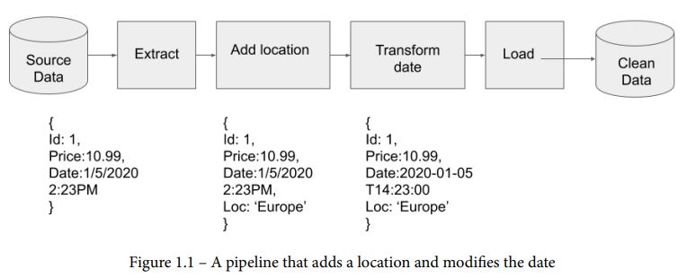
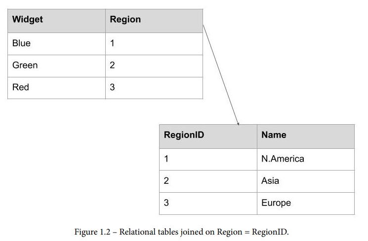
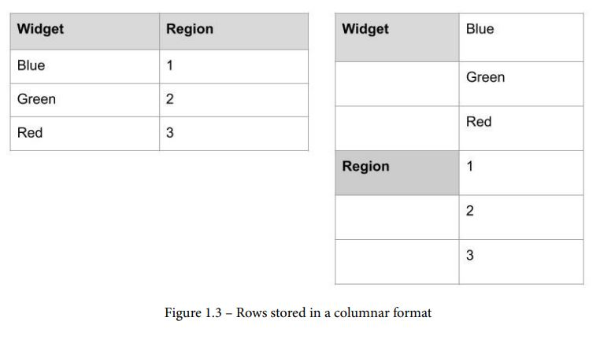

<!-- language: rtl -->
<div dir="rtl" align="right" >

### وظایف مهندسان داده  
مهندسی داده بخشی از اکوسیستم کلان‌داده است و ارتباط نزدیکی با علم داده دارد.  
مهندسان داده معمولاً در پس‌زمینه کار می‌کنند و به اندازه دانشمندان داده مورد توجه قرار نمی‌گیرند، اما نقش کلیدی در فرآیند علم داده دارند.  

#### مسئولیت‌های مهندس داده  
مسئولیت‌های یک مهندس داده بسته به سطح بلوغ داده‌ای و میزان نیروی انسانی سازمان متفاوت است، اما برخی از وظایف، مانند **استخراج (Extract)، بارگذاری (Load) و تبدیل (Transform) داده**، از وظایف اساسی این نقش هستند.  

**در ابتدایی‌ترین سطح، مهندسی داده شامل انتقال داده از یک سیستم یا فرمت به سیستم یا فرمت دیگر است.** در قالب مفاهیم رایج‌تر:  
- مهندسان داده داده‌ها را از یک منبع استخراج می‌کنند (**Extract**)  
- سپس برخی تغییرات و پردازش‌ها را روی آن انجام می‌دهند (**Transform**)  
- در نهایت، داده‌ها را در محلی قرار می‌دهند که کاربران بتوانند به داده‌های باکیفیت و قابل اطمینان دسترسی داشته باشند (**Load**)  

این فرآیند با نام **ETL (Extract, Transform, Load)** شناخته می‌شود و یکی از مفاهیم کلیدی در مهندسی داده محسوب می‌شود. حال با یک مثال به درک عمیق‌تر این حوزه می‌پردازیم.  

### مثال: فروشگاه آنلاین و نیاز به مهندسی داده  
یک خرده‌فروش آنلاین را در نظر بگیرید که در وب‌سایت خود ویجت‌هایی با رنگ‌های مختلف می‌فروشد.  
این وب‌سایت از یک **پایگاه داده رابطه‌ای** پشتیبانی می‌شود که تمام تراکنش‌های انجام‌شده را ذخیره می‌کند.  

اکنون می‌خواهیم به این سؤال پاسخ دهیم:  
**در سه‌ماهه گذشته، چند ویجت آبی رنگ به فروش رسیده است؟**  

در ابتدا می‌توان یک **کوئری SQL** روی پایگاه داده اجرا کرد تا پاسخ این پرسش را دریافت کرد. اما این مسئله نیازی به یک مهندس داده ندارد.  

### ورود به دنیای مهندسی داده  
با رشد فروشگاه، اجرای کوئری روی پایگاه داده **تولیدی (Production Database)** دیگر امکان‌پذیر نخواهد بود. علاوه بر این، ممکن است بیش از یک پایگاه داده برای ثبت تراکنش‌ها وجود داشته باشد.  
برای مثال، ممکن است پایگاه داده‌ای برای مناطق جغرافیایی مختلف تعریف شده باشد:  
- یک پایگاه داده برای فروشندگان در آمریکای شمالی  
- پایگاه‌های داده مجزا برای فروشندگان در آسیا، آفریقا و اروپا  

در چنین شرایطی، مهندسی داده وارد عمل می‌شود.  
**مهندس داده اتصال‌هایی به تمام پایگاه‌های داده تراکنش‌های منطقه‌ای ایجاد می‌کند، داده‌ها را استخراج کرده و سپس در یک انبار داده (Data Warehouse) بارگذاری می‌کند.**  
در این مرحله، می‌توان تعداد ویجت‌های آبی فروخته‌شده را محاسبه کرد.  

### پرسش‌های پیچیده‌تر برای تحلیل داده  
شرکت‌ها معمولاً به‌دنبال پاسخ سؤالات پیچیده‌تری هستند، از جمله:  
- چگونه می‌توان متوجه شد که کدام مناطق بیشترین میزان فروش ویجت را دارند؟  
- اوج زمان‌های فروش ویجت چه ساعاتی است؟  
- چه تعداد کاربر ویجت‌ها را به سبد خرید خود اضافه کرده و سپس حذف کرده‌اند؟  
- چه ترکیبی از ویجت‌ها بیشتر با هم فروخته می‌شوند؟  

اینجا جایی است که مهندسان داده با ایجاد **پایپ‌لاین‌های داده‌ای (Data Pipelines)**، **مدل‌سازی داده‌ها** و **بهینه‌سازی پردازش داده**، ارزش واقعی خود را نشان می‌دهند.

### پردازش پیچیده‌تر داده‌ها در مهندسی داده  
پاسخ به این سؤالات فراتر از **استخراج (Extract)** و **بارگذاری (Load)** داده‌ها در یک سیستم واحد است. بین این دو مرحله، **تبدیل داده (Transform)** ضروری است.  

یکی از چالش‌های کلیدی، تفاوت **مناطق زمانی (Time Zones)** در مناطق مختلف جغرافیایی است.  
برای مثال، ایالات متحده به‌تنهایی **چهار منطقه زمانی** دارد. بنابراین، برای تحلیل دقیق، باید **تمام فیلدهای زمانی به یک استاندارد یکسان تبدیل شوند.**  

### افزودن فیلد موقعیت جغرافیایی  
علاوه بر تبدیل زمان، نیاز به روشی برای **تشخیص فروش در هر منطقه** وجود دارد. این کار را می‌توان با افزودن یک **فیلد موقعیت مکانی (Location Field)** به داده‌ها انجام داد.  

حال این سؤال مطرح می‌شود:  
**این فیلد باید به چه فرمتی باشد؟**  
- **فرمت مکانی (Spatial Format):** شامل **مختصات جغرافیایی (Coordinates)** یا **متن استاندارد مکانی (Well-Known Text - WKT)**  
- **فرمت متنی ساده:** که بعداً در یک پایپ‌لاین مهندسی داده قابل تبدیل و پردازش باشد  

انتخاب فرمت مناسب بستگی به نیازهای کسب‌وکار و نحوه تحلیل داده‌ها دارد.
### ایجاد پایپ‌لاین داده برای پردازش اطلاعات  
در این مرحله، مهندس داده باید مراحل زیر را انجام دهد:  
1. **استخراج داده‌ها** از هر پایگاه داده  
2. **افزودن فیلد موقعیت مکانی** برای مشخص کردن مکان هر تراکنش  
3. **تبدیل زمان محلی به استاندارد ISO 8601** برای یکسان‌سازی مناطق زمانی  
4. **بارگذاری داده‌ها** در انبار داده (Data Warehouse)  

### پایپ‌لاین داده (Data Pipeline)  
ترکیب این مراحل با ایجاد یک **پایپ‌لاین داده** انجام می‌شود.  

**ویژگی‌های پایپ‌لاین داده:**  
- داده‌های خام (Raw Data) وارد پایپ‌لاین می‌شوند.  
- داده‌ها ممکن است **ناقص** باشند یا **اشتباهات تایپی** داشته باشند.  
- در طول مسیر، داده‌ها **تمیزسازی (Cleaning)** و **اصلاح (Transformation)** می‌شوند.  
- در نهایت، داده‌های پردازش‌شده در انبار داده ذخیره می‌شوند و آماده **کوئری‌گیری (Querying)** خواهند بود.  

**🔹 در ادامه، یک دیاگرام پایپ‌لاین داده نمایش داده خواهد شد که نحوه اجرای این فرآیند را نشان می‌دهد.**



---
### مهارت‌ها و دانش مورد نیاز برای مهندسی داده  

در مثال قبلی، مشخص شد که **مهندسان داده** باید با **فناوری‌های متنوعی** آشنا باشند. این در حالی است که هنوز به نیازهای کسب‌وکار و فرآیندهای آن اشاره نکرده‌ایم.  

#### 1. **استخراج داده از منابع مختلف**  
- آشنایی با **فرمت‌های متنوع فایل‌ها** و **پایگاه‌های داده مختلف**  
- تسلط بر **SQL** برای استخراج داده‌ها  
- تسلط بر **Python** برای پردازش داده‌ها و خودکارسازی عملیات  

#### 2. **تبدیل داده (Transformation) و مدل‌سازی داده**  
- دانش **مدل‌سازی داده (Data Modeling)** و **ساختارهای داده**  
- درک فرآیندهای کسب‌وکار و نیازهای تحلیلی  
- طراحی مدل‌های داده‌ای متناسب با نیازهای سازمان  

#### 3. **بارگذاری داده در انبار داده (Data Warehouse)**  
- طراحی و ایجاد **Schema** برای انبار داده  
- دانش پایه‌ای درباره **طراحی انبار داده**  
- آشنایی با **پایگاه‌های داده تحلیلی** و ابزارهای مرتبط  

#### 4. **مدیریت زیرساخت‌های پردازش داده**  
- مدیریت **سرورهای لینوکسی** و پیکربندی سرویس‌ها  
- آشنایی با ابزارهای مدیریت داده مانند **Apache Airflow** و **Apache NiFi**  
- کار با **سکوهای ابری (Cloud Platforms)** مانند **AWS, Google Cloud, Azure** برای ایجاد و مدیریت زیرساخت‌ها  

### تعریف جامع‌تری از مهندسی داده  
اکنون که مثالی از **وظایف مهندس داده** بررسی شد، می‌توان یک **تعریف گسترده‌تر از مهندسی داده** ارائه داد.
### **تعریف مهندسی داده**  
**مهندسی داده** شامل **توسعه، اجرا و نگهداری زیرساخت‌های داده** است که می‌تواند:  
- **در محل (On-Premises)**  
- **در فضای ابری (Cloud)**  
- **به‌صورت ترکیبی (Hybrid) یا چند ابری (Multi-Cloud)**  

باشد.  

این زیرساخت شامل **پایگاه‌های داده** و **پایپ‌لاین‌های داده** است که برای **استخراج (Extract)، تبدیل (Transform) و بارگذاری (Load) داده‌ها** طراحی و پیاده‌سازی می‌شوند.

---
### **تفاوت مهندسی داده و علم داده**  

**مهندسی داده** زیربنای اصلی برای اجرای **علم داده** است. بسته به میزان **بلوغ داده‌ای** یک سازمان، ممکن است از **دانشمندان داده** انتظار برود که داده‌های مورد نیاز خود را **پاک‌سازی** و **انتقال** دهند، اما این کار بهره‌وری آنها را کاهش می‌دهد. هرچند که **مهندسان داده** و **دانشمندان داده** ابزارهای مشابهی مانند **Python** را به کار می‌برند، اما تمرکز آنها متفاوت است:  

| **مهندسی داده** | **علم داده** |
|----------------|------------|
| طراحی و مدیریت **فرمت‌ها، مدل‌ها و ساختارهای داده** برای انتقال کارآمد داده‌ها | استفاده از داده‌ها برای **ساخت مدل‌های آماری و محاسبات ریاضی** |
| ایجاد و نگهداری **انبار داده (Data Warehouse)** | استخراج داده‌ها از انبار داده برای تحلیل و **مدل‌های یادگیری ماشین** |
| پیاده‌سازی **پایپ‌لاین‌های داده** برای پردازش خودکار داده‌ها | تحلیل داده و ارائه **بینش کسب‌وکار** |
| بهینه‌سازی زیرساخت برای **مقیاس‌پذیری و پردازش سریع داده‌ها** | توسعه الگوریتم‌ها برای **پیش‌بینی و تحلیل داده** |

### **همکاری بین مهندسان داده و دانشمندان داده**  
- **دانشمندان داده** از **انبار داده** ایجادشده توسط مهندسان داده استفاده می‌کنند.  
- مدل‌های یادگیری ماشین ممکن است در **پایپ‌لاین داده** یکپارچه شوند.  
- درک نیازهای دانشمندان داده، به **بهینه‌سازی فرآیندهای مهندسی داده** کمک می‌کند.  

---
### **ابزارهای مهندسی داده**  

برای ساخت **پایپ‌لاین‌های داده**، مهندسان داده باید ابزارهای مناسبی را انتخاب کنند. مهندسی داده بخشی از **اکوسیستم کلان‌داده (Big Data)** است و باید سه ویژگی اصلی **کلان‌داده** را در نظر بگیرد:  

#### **۱. حجم (Volume)**  
- حجم داده‌ها به‌شدت افزایش یافته است.  
- جابجایی **هزار رکورد** در یک پایگاه داده با جابجایی **میلیون‌ها ردیف** یا **پردازش میلیون‌ها تراکنش در دقیقه** کاملاً متفاوت است.  

#### **۲. تنوع (Variety)**  
- داده‌ها در **فرمت‌های متنوع** ذخیره می‌شوند.  
- مهندسان داده باید ابزارهایی را انتخاب کنند که بتوانند **داده‌های مختلف** را از **پایگاه‌های داده، APIها و فایل‌ها** پردازش کنند.  

#### **۳. سرعت (Velocity)**  
- **سرعت تولید داده‌ها** در حال افزایش است.  
- ردیابی فعالیت میلیون‌ها کاربر در یک **شبکه اجتماعی** یا **ثبت خرید کاربران در سطح جهانی** نیازمند **پردازش داده در نزدیک به زمان واقعی (Near Real-Time Processing)** است.  

### **بخش بعدی: معرفی ابزارهای رایج در مهندسی داده**  
در ادامه، با **ابزارهای پرکاربرد مهندسی داده** که برای پردازش و مدیریت حجم بالای داده استفاده می‌شوند، آشنا خواهیم شد.

### **زبان‌های برنامه‌نویسی در مهندسی داده**  

**SQL** زبان اصلی مهندسی داده محسوب می‌شود. چه از ابزارهای **low-code** استفاده کنید و چه یک زبان برنامه‌نویسی خاص، یادگیری SQL اجتناب‌ناپذیر است.  

- تسلط بر **SQL** به مهندسان داده کمک می‌کند تا **کوئری‌ها را بهینه‌سازی** کرده و **تحول‌های داده‌ای** را مدیریت کنند.  
- حتی **Data Lake**ها و پایگاه‌های داده **NoSQL** نیز ابزارهایی برای اجرای **SQL** دارند.  

#### **زبان‌های رایج در مهندسی داده**  

✅ **Python** 
- **کراس‌پلتفرم و مستندات قوی**  
- **پشتیبانی از کتابخانه‌های گسترده‌ای** مثل:  
  - **pandas، matplotlib، numpy، scipy** (برای پردازش و تحلیل داده)  
  - **scikit-learn، tensorflow، pytorch، NLTK** (برای یادگیری ماشین و پردازش زبان طبیعی)  

### **پایگاه‌های داده**  

در بیشتر سیستم‌های تولید، داده‌ها در **پایگاه‌های داده رابطه‌ای** ذخیره می‌شوند.  
- **راه‌حل‌های اختصاصی** معمولاً از **Oracle** یا **Microsoft SQL Server** استفاده می‌کنند.  
- **راه‌حل‌های متن‌باز** معمولاً از **MySQL** یا **PostgreSQL** استفاده می‌کنند.  

این پایگاه‌های داده داده‌ها را در **رکوردها** ذخیره کرده و برای **ثبت تراکنش‌ها** مناسب هستند.  
همچنین، **روابطی** بین جداول وجود دارد که از **کلیدهای اصلی (Primary Keys)** برای پیوستن داده‌ها از یک جدول به جدول دیگر استفاده می‌شود، که این ویژگی آنها را به **پایگاه‌های داده رابطه‌ای** تبدیل می‌کند.

### **مدل ساده داده و روابط بین جداول**  
در تصویر زیر، یک مدل ساده داده و روابط میان جداول نمایش داده شده است.



### **پایگاه‌های داده در انبار داده (Data Warehousing)**  

رایج‌ترین پایگاه‌های داده‌ای که در **انبار داده‌ها** استفاده می‌شوند عبارتند از:

- **Amazon Redshift**
- **Google BigQuery**
- **Apache Cassandra**
- پایگاه‌های داده **NoSQL** دیگر مانند **Elasticsearch**

این پایگاه‌های داده برخلاف پایگاه‌های داده رابطه‌ای که داده‌ها را به‌صورت **رکورد** ذخیره می‌کنند، داده‌ها را به‌صورت **ستونی (Columnar Format)** ذخیره می‌کنند، همانطور که در تصویر زیر نشان داده شده است.



### **پایگاه‌های داده ستونی و NoSQL**  

**پایگاه‌های داده ستونی (Columnar Databases)** برای **پرس‌وجوهای سریع‌تر** مناسب‌تر هستند و به همین دلیل برای **انبار داده‌ها** بسیار کارآمد هستند.  
- تمام این پایگاه‌های داده ستونی (مانند **Amazon Redshift**، **Google BigQuery**، و **Apache Cassandra**) می‌توانند با استفاده از **SQL** کوئری شوند، اگرچه **Cassandra** از **Cassandra Query Language (CQL)** استفاده می‌کند که مشابه SQL است.  

**پایگاه‌های داده NoSQL و مستندات**  
- **Elasticsearch** یکی از پایگاه‌های داده **NoSQL** است که در واقع یک **موتور جستجو** مبتنی بر **Apache Lucene** است.  
- **Elasticsearch** مشابه **Apache Solr** است اما کاربرپسندتر می‌باشد.  
- این پایگاه داده متن‌باز است، اما اجزای **اختصاصی** نیز دارد، از جمله **X-Pack plugins** برای یادگیری ماشین، گراف‌ها، امنیت، و هشدارها/نظارت‌ها.  
- **Elasticsearch** از **Elastic Query DSL** (زبان اختصاصی دامنه) برای پرس‌وجو استفاده می‌کند که **SQL** نیست بلکه یک **پرس‌وجوی JSON** است.  
- Elasticsearch داده‌ها را به‌صورت **مدارک (Documents)** ذخیره می‌کند و برخلاف پایگاه‌های داده رابطه‌ای، **غیررابطه‌ای** است.  

## **پردازش داده‌ها**  
زمانی که یک مهندس داده داده‌ها را از پایگاه داده استخراج می‌کند، نیاز به **تحول یا پردازش** آنها دارد.  
در دنیای **داده‌های بزرگ**، استفاده از یک **موتور پردازش داده** به شدت کمک‌کننده است.

### موتورهای پردازش داده  

موتورهای پردازش داده به مهندسان داده این امکان را می‌دهند که داده‌ها را چه به‌صورت **Batch** و چه به‌صورت **Stream** پردازش و تبدیل کنند. این موتورها اجرای موازی وظایف مربوط به تبدیل داده را فراهم می‌کنند.  

#### **Apache Spark**  
یکی از محبوب‌ترین موتورهای پردازش داده **Apache Spark** است. این موتور به مهندسان داده اجازه می‌دهد که تبدیلات خود را با استفاده از **Python**، **Java** و **Scala** بنویسند. Apache Spark به‌خوبی با **Python DataFrames** کار می‌کند، که آن را به ابزاری مناسب برای برنامه‌نویسان **Python** تبدیل کرده است. علاوه بر DataFrame، Spark دارای **Resilient Distributed Datasets (RDDs)** نیز هست.  

**RDDs** 

مجموعه‌ای **توزیع‌شده و غیرقابل تغییر (Immutable)** از اشیا هستند که عمدتاً از طریق بارگذاری داده از یک منبع خارجی ایجاد می‌شوند. **RDDها پردازش سریع و توزیع‌شده را ممکن می‌سازند** و وظایف تعریف‌شده در یک RDD روی گره‌های مختلف یک **کلاستر (Cluster)** اجرا می‌شوند. برخلاف DataFrameها، **RDDها سعی نمی‌کنند به‌صورت خودکار ساختار (Schema) داده را تشخیص دهند.**  

#### **سایر موتورهای پردازش داده**  
علاوه بر Spark، موتورهای پردازشی دیگری نیز وجود دارند، از جمله:  

- **Apache Storm**: \
این موتور از **Spout** برای خواندن داده و **Bolt** برای پردازش داده استفاده می‌کند. با اتصال این اجزا به یکدیگر، می‌توان یک **Pipeline پردازشی** ایجاد کرد. 

- **Apache Flink و Apache Samza**:\
 این دو فریمورک مدرن برای پردازش **Stream و Batch** هستند و امکان پردازش **Unbounded Stream** را فراهم می‌کنند.  

### **Unbounded Stream چیست؟**  
یک **Unbounded Stream** جریانی از داده است که پایان مشخصی ندارد. برای مثال، **سنسور دما** که به‌طور مداوم دما را گزارش می‌دهد، یک **Unbounded Stream** محسوب می‌شود.  

اگر از **Apache Kafka** برای استریم داده‌ها از یک سیستم استفاده می‌کنید، **Flink و Samza گزینه‌های مناسبی** برای پردازش داده‌های دریافتی هستند. در ادامه این کتاب، اطلاعات بیشتری درباره **Apache Kafka** خواهید آموخت./


## **Data Pipelines (خطوط پردازش داده)**  

یک **Data Pipeline** ترکیبی از یک **پایگاه داده تراکنشی (Transactional Database)**، یک **زبان برنامه‌نویسی**، یک **موتور پردازش داده** و یک **انبار داده (Data Warehouse)** است.  

#### **مثال ساده از یک Data Pipeline**  
تصور کنید که می‌خواهید تمام رکوردهای مربوط به فروش یک محصول را از پایگاه داده استخراج کنید، سپس داده‌ها را از طریق **Apache Spark** پردازش کنید تا تعداد فروش هر محصول را محاسبه کنید و در نهایت نتیجه را در **Data Warehouse** ذخیره کنید. این یک **Pipeline پردازش داده** محسوب می‌شود.  

اما اگر بخواهید این فرآیند را هر بار **به‌صورت دستی اجرا کنید**، این Pipeline چندان مفید نخواهد بود. برای **اتوماتیک‌سازی** اجرای آن، نیاز به یک **Scheduler** دارید که بتواند پردازش‌ها را در بازه‌های زمانی مشخص اجرا کند.  

#### **برنامه‌ریزی Pipeline با Crontab**  
ساده‌ترین راه برای زمان‌بندی اجرای Pipeline استفاده از **crontab** در لینوکس است. شما می‌توانید یک **cron job** برای اجرای فایل **Python** خود تعریف کنید تا در **فواصل زمانی مشخص** اجرا شود.  

مثال تعریف یک کران جاب که اسکریپت `pipeline.py` را هر ۶ ساعت اجرا می‌کند:  
```bash
0 */6 * * * /usr/bin/python3 /path/to/pipeline.py
```
با این کار، بدون نیاز به اجرای دستی، Pipeline به‌صورت **دوره‌ای** اجرا خواهد شد.

#### **مشکلات مدیریت Pipeline در Crontab**  
با افزایش تعداد **Pipelineها**، مدیریت آن‌ها در **crontab** دشوار می‌شود. برخی از چالش‌ها عبارت‌اند از:  
- **مانیتورینگ اجرای Pipeline**: چگونه متوجه شوید که کدام پردازش **موفقیت‌آمیز** بوده و کدام یک **ناموفق** اجرا شده است؟  
- **رهگیری Pipelineهای اجراشده**: چگونه بدانید که چه Pipelineهایی اجرا شده‌اند و کدام‌یک **اجرا نشده‌اند**؟  
- **مدیریت Backpressure**: اگر یکی از **وظایف (Tasks)** سریع‌تر از وظیفه بعدی اجرا شود، چگونه می‌توان داده‌ها را **کنترل** کرد تا وظایف بعدی **با حجم بالای داده دچار مشکل نشوند**؟  

### **راهکار جایگزین برای مدیریت پیشرفته‌ی Data Pipeline**  
با پیچیده‌تر شدن **Pipelineها**، **Crontab دیگر کافی نخواهد بود** و شما نیاز به یک **فریمورک قدرتمندتر** برای مدیریت Pipelineها خواهید داشت، مانند:  
- **Apache Airflow**  
- **Luigi**  
- **Prefect**  

این ابزارها امکاناتی مانند **مانیتورینگ، لاگ‌گیری، مدیریت وابستگی بین وظایف (Task Dependencies)** و **مدیریت حجم داده (Backpressure Handling)** را در اختیار شما قرار می‌دهند.

## **Apache Airflow**  

محبوب‌ترین فریمورک برای ساخت Data Pipeline در Python است 
. این پلتفرم توسط Airbnb توسعه داده شده و یک مدیر گردش‌کار (Workflow Management Platform) محسوب می‌شود.  

#### **اجزای اصلی Airflow**  
Airflow از چندین مؤلفه کلیدی تشکیل شده است:  
- **Web Server**: رابط کاربری برای مانیتورینگ و مدیریت DAGها  
- **Scheduler**: زمان‌بندی و اجرای وظایف (Tasks)  
- **Metastore**: پایگاه داده‌ای برای ذخیره اطلاعات مربوط به DAGها، اجرای Taskها، و وضعیت آن‌ها  
- **Queueing System**: مدیریت صف اجرای وظایف  
- **Executors**: اجرای وظایف روی یک یا چندین Worker  

می‌توان **Airflow را روی یک سرور واحد اجرا کرد**، اما در محیط **Production** معمولاً به‌صورت **کلاستر با چندین Executor Node** راه‌اندازی می‌شود.  

### DAG در Airflow چیست؟  

Airflow از Directed Acyclic Graphs (DAGs) برای تعریف Pipelineهای داده استفاده می‌کند.  

DAG یک کد Python است که شامل تعریف وظایف (Tasks) و وابستگی‌های آن‌ها است.  
+ Directed به این معنی است که وظایف دارای ترتیب مشخصی هستند و هر Task بعد از Task وابسته به خود اجرا می‌شود.  
+ **Acyclic** به این معنی است که **حلقه (Loop) وجود ندارد** و جریان داده فقط در یک جهت حرکت می‌کند.  

### **مثال یک DAG در Airflow**  
در سناریوی قبلی که یک **Pipeline پردازش فروش محصولات** داشتیم، DAG به‌صورت زیر خواهد بود:  
1. اجرای **SQL Query** برای دریافت اطلاعات فروش  
2. اجرای پردازش در **Spark** برای محاسبه تعداد فروش محصولات  
3. ذخیره خروجی پردازش در **Data Warehouse**  

در نمودار DAG، این فرآیند به‌صورت یک **جریان متوالی از Taskها** نمایش داده می‌شود.  


### **Apache NiFi در مقایسه با Airflow**  
هرچند این کتاب **مبانی Airflow** را پوشش می‌دهد، اما بیشتر از **Apache NiFi** برای نمایش مفاهیم **مهندسی داده** استفاده خواهد کرد.  

**نکته:** **Apache NiFi** یک ابزار گرافیکی برای **انتقال و پردازش داده‌ها در لحظه (Real-Time)** است و بیشتر برای **Data Ingestion** و **ETL** استفاده می‌شود، در حالی که **Airflow** بیشتر برای **زمان‌بندی و هماهنگی پردازش‌های داده‌ای** مناسب است.

## **Apache NiFi**  

**Apache NiFi** یکی دیگر از فریمورک‌های محبوب برای **ساخت Data Pipeline** است که مانند **Airflow** از **DAG** استفاده می‌کند. این فریمورک ابتدا توسط **NSA (آژانس امنیت ملی آمریکا)** توسعه داده شد و اکنون در بسیاری از **نهادهای دولتی و سازمانی** مورد استفاده قرار می‌گیرد.  


### **مزایای Apache NiFi**  
✅ **راه‌اندازی آسان**: نسبت به **Airflow**، نصب و راه‌اندازی **ساده‌تر** دارد و برای **مهندسان داده تازه‌کار** مناسب است.  
✅ **رابط کاربری گرافیکی قدرتمند (GUI)**: نیازی به کدنویسی زیاد نیست و بسیاری از پردازش‌ها را می‌توان از طریق **پیکربندی ساده** انجام داد.  
✅ **پشتیبانی از زبان‌های مختلف**: امکان نوشتن پردازش‌ها در **Jython, Clojure, Scala, Groovy**  
✅ **قابلیت Clustering و اجرای توزیع‌شده**: امکان اجرای **Pipelineها روی چندین سرور**  
✅ **مدیریت Backpressure و مانیتورینگ**: برای کنترل حجم داده‌های در حال پردازش  
✅ **کنترل نسخه**: از طریق **NiFi Registry**  
✅ **داده‌برداری در Edge**: از طریق **MiNiFi**، می‌توان داده‌ها را از دستگاه‌های IoT و منابع توزیع‌شده جمع‌آوری کرد.  


### **NiFi در مقایسه با سایر ابزارها**  
| ابزار  | زبان اصلی | رابط گرافیکی | مناسب برای | قابلیت Clustering | استفاده برای |  
|--------|------------|--------------|------------|------------------|-----------------|  
| **Apache NiFi** | Java | دارد | پردازش داده در لحظه (Real-Time) | بله | **Data Ingestion، ETL، IoT** |  
| **Apache Airflow** | Python | دارد | زمان‌بندی و هماهنگی پردازش‌ها | بله | **Batch Processing، Orchestration** |  
| **Luigi (Spotify)** | Python | دارد | مدیریت وابستگی‌های پردازش داده | خیر | **Task Automation، ETL** |  

**تفاوت اصلی**: **Airflow** برای **هماهنگی وظایف (Task Orchestration)** در **Batch Processing** مناسب است، درحالی‌که **NiFi** بیشتر برای **انتقال و پردازش داده‌های جریانی (Streaming Data)** و **ETL در لحظه (Real-Time ETL)** استفاده می‌شود.  

### **Luigi – جایگزین دیگری برای Data Pipeline در Python**  
علاوه بر Airflow و NiFi، ابزار **Luigi** که توسط **Spotify** توسعه یافته، یکی دیگر از گزینه‌های **Python-based** برای **مدیریت Data Pipeline** است.  
- از **Graph Structure** برای اتصال Taskها استفاده می‌کند.  
- رابط گرافیکی مشابه Airflow دارد.  
- برای **زمان‌بندی وظایف و مدیریت وابستگی‌ها** در **پردازش دسته‌ای (Batch Processing)** مناسب است.  

**نکته:** این کتاب بر روی **NiFi** تمرکز دارد و **Luigi پوشش داده نخواهد شد**، اما این ابزار همچنان گزینه‌ای **قدرتمند و سبک** برای **مهندسان داده‌ی Python** محسوب می‌شود.