<!-- language: rtl -->
<div dir="rtl" align="right" >

# **ساخت زیرساخت مهندسی داده**  

در فصل قبل، با **نقش‌ها و مسئولیت‌های مهندس داده** آشنا شدیم و ابزارهای کلیدی مورد استفاده در این حوزه را معرفی کردیم؛ از جمله انواع **دیتابیس‌ها، زبان‌های برنامه‌نویسی، و ابزارهای ایجاد و زمان‌بندی Data Pipeline**.  

در این فصل، قصد داریم **ابزارهای موردنیاز را نصب و پیکربندی کنیم** تا در ادامه‌ی مسیر از آن‌ها برای ساخت **پایپ‌لاین‌های داده و تحلیل نتایج** استفاده کنیم.  

---

## **ابزارهایی که در این فصل نصب و پیکربندی می‌کنیم**  
🔹 **دیتابیس‌ها:**  
- **PostgreSQL**  
- **Elasticsearch**  

🔹 **ابزارهای ساخت پایپ‌لاین داده:**  
- **Apache Airflow**  
- **Apache NiFi**  

🔹 **ابزارهای مدیریتی و بصری‌سازی داده:**  
- **pgAdmin** (برای مدیریت PostgreSQL)  
- **Kibana** (برای مدیریت و تحلیل داده در Elasticsearch)  

---

## **چرا به این ابزارها نیاز داریم؟**  
✅ **اجرای پایپ‌لاین‌های داده**: انتقال داده از یک منبع به مقصد  
✅ **مدیریت پردازش داده**: زمان‌بندی و هماهنگ‌سازی فرآیندهای ETL  
✅ **بصری‌سازی داده**: مشاهده و تحلیل داده‌های پردازش‌شده برای **دیباگ و تحلیل**  
✅ **مدیریت و ذخیره‌سازی داده**: استفاده از **PostgreSQL و Elasticsearch** برای **ذخیره و جستجوی داده‌ها**  

هرچند با پیشرفت در مسیر یادگیری، ممکن است دیگر نیازی به برخی از این ابزارها نداشته باشید، اما **درک پایه‌ای از آن‌ها برای پشتیبانی از سایر کاربران و نقش‌ها در تیم داده ضروری است**.  

---

## **موضوعات این فصل**  
🔹 **نصب و پیکربندی Apache NiFi**  
🔹 **نصب و پیکربندی Apache Airflow**  
🔹 **نصب و پیکربندی Elasticsearch**  
🔹 **نصب و پیکربندی Kibana**  
🔹 **نصب و پیکربندی PostgreSQL**  
🔹 **نصب pgAdmin 4**  

در ادامه، **گام‌به‌گام این ابزارها را نصب و تنظیم خواهیم کرد** تا بتوانید از آن‌ها در **پروژه‌های مهندسی داده** خود استفاده کنید.


----
# **نصب و پیکربندی Apache NiFi**  

**Apache NiFi** یکی از ابزارهای اصلی برای **ساخت پایپ‌لاین‌های مهندسی داده** است. این ابزار به شما امکان می‌دهد **بدون نیاز به کدنویسی، پایپ‌لاین‌های داده‌ای بسازید** و از پردازشگرهای از پیش ساخته‌شده استفاده کنید.  

**ویژگی‌های کلیدی NiFi:**  
✅ **عدم نیاز به کدنویسی** برای اجرای پایپ‌لاین‌ها  
✅ **دارای زمان‌بندی داخلی** برای اجرای خودکار پردازش‌ها  
✅ **مدیریت backpressure** (در صورت ناهماهنگی سرعت پردازش بین دو تسک)  

---

## **مراحل نصب Apache NiFi**  

### **۱. دانلود Apache NiFi**  
NiFi را از [وب‌سایت رسمی](https://nifi.apache.org/download.html) دانلود کنید یا از دستور زیر استفاده کنید:  

```bash
curl https://mirrors.estointernet.in/apache/nifi/1.12.1/nifi-1.12.1-bin.tar.gz -o nifi.tar.gz
```

### **۲. استخراج فایل‌های NiFi**  
پس از دانلود، فایل را استخراج کنید:  

```bash
tar xvzf nifi.tar.gz
```

### **۳. اجرای Apache NiFi**  
وارد فولدر استخراج‌شده شوید و NiFi را اجرا کنید:  

```bash
cd nifi-1.12.1
bin/nifi.sh start
```

### **۴. بررسی وضعیت اجرای NiFi**  
برای بررسی وضعیت اجرا، دستور زیر را وارد کنید:  

```bash
sudo bin/nifi.sh status
```

✅ اگر **JAVA_HOME تنظیم باشد**، مسیر آن در خروجی نمایش داده می‌شود.  

### **۵. نصب Java (در صورت نیاز)**  
اگر **JAVA_HOME تنظیم نبود**، Java را نصب کنید:  

```bash
sudo apt install openjdk-11-jre-headless
```

### **۶. تنظیم متغیر JAVA_HOME**  
مسیر Java را در فایل `.bash_profile` اضافه کنید:  

```bash
export JAVA_HOME=/usr/lib/jvm/java-11-openjdk-amd64
```

### **۷. بارگذاری مجدد تنظیمات**  
برای اعمال تغییرات، دستور زیر را اجرا کنید:  

```bash
source ~/.bash_profile
```

### **۸. بررسی مجدد اجرای NiFi**  
دوباره وضعیت NiFi را بررسی کنید:  

```bash
sudo bin/nifi.sh status
```

✅ اگر مسیر `JAVA_HOME` نمایش داده شد، NiFi به درستی نصب شده و آماده اجرا است.
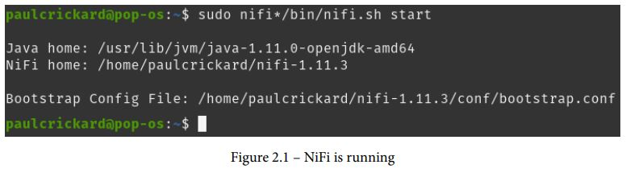

### **۹. اجرای رابط کاربری NiFi**  
پس از اجرای NiFi، مرورگر خود را باز کنید و به آدرس زیر بروید:  

```
http://localhost:8080/nifi/
```

✅ اگر نصب به‌درستی انجام شده باشد، باید رابط گرافیکی **NiFi** را مشاهده کنید.  

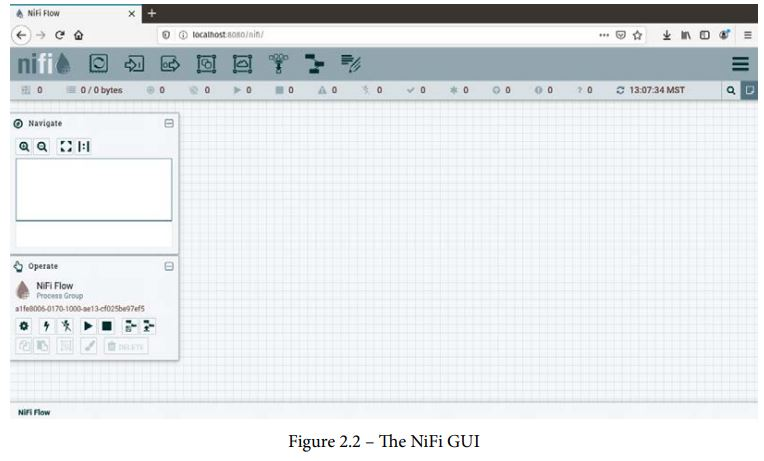
---

## **تغییر پورت پیش‌فرض NiFi**  
به‌صورت پیش‌فرض، NiFi روی پورت **8080** اجرا می‌شود. برای تغییر این پورت به **9300**، مراحل زیر را انجام دهید:  

1️⃣ فایل **پیکربندی** را ویرایش کنید:  

```bash
nano conf/nifi.properties
```

2️⃣ مقدار **پورت پیش‌فرض** را تغییر دهید:  

```ini
# web properties #
nifi.web.http.port=9300
```

3️⃣ اگر **فایروال فعال است**، پورت جدید را باز کنید:  

```bash
sudo ufw allow 9300/tcp
```

4️⃣ **NiFi را مجدداً راه‌اندازی کنید**:  

```bash
bin/nifi.sh restart
```

5️⃣ اکنون **GUI را در پورت جدید مشاهده کنید**:  

```
http://localhost:9300/nifi/
```

---

## **آشنایی با محیط گرافیکی (GUI) Apache NiFi**  
پس از ورود به NiFi، صفحه **خالی** خواهد بود زیرا هنوز پردازشی تعریف نشده است.  

✅ در بالای صفحه، دو بخش مهم وجود دارد:  

🔹 **نوار ابزار (Component Toolbar):** ابزارهای موردنیاز برای **ایجاد جریان داده**  
🔹 **نوار وضعیت (Status Bar):** نمایش اطلاعات مربوط به **وضعیت NiFi**  

---
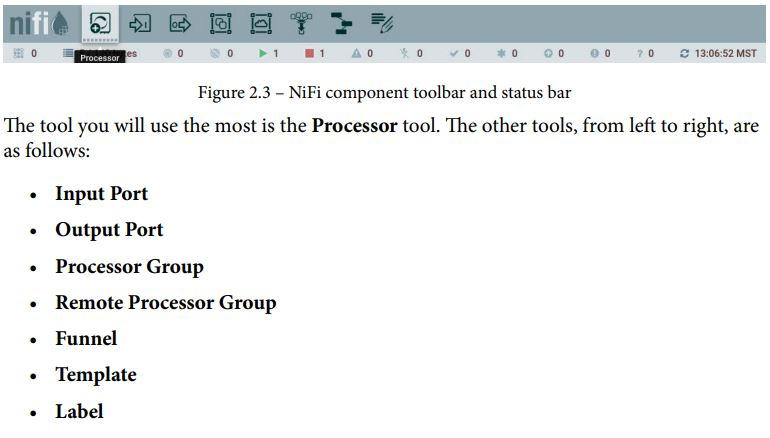
## **ایجاد اولین جریان داده (Data Flow) در NiFi**  

### **۱. اضافه کردن یک پردازشگر (Processor)**  
1️⃣ روی **آیکون Processor** کلیک کنید و آن را به صفحه **بکشید (Drag & Drop)**.  
2️⃣ در پنجره جستجو، پردازشگر **GenerateFlowFile** را انتخاب کنید.  
🔹 این پردازشگر، فایل‌هایی را با محتوای متنی تولید می‌کند.  

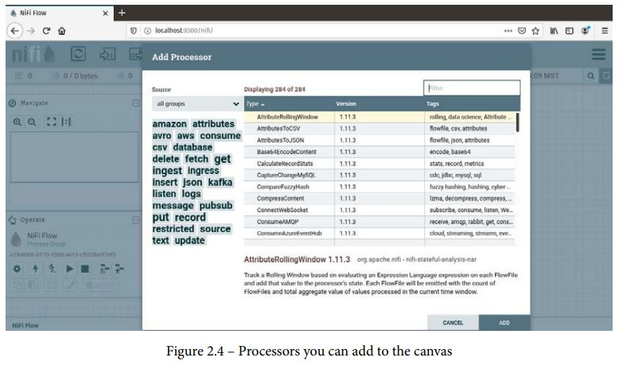

### **۲. اضافه کردن پردازشگر دوم (Processor)**  
1️⃣ مجدداً ابزار **Processor** را به صفحه **بکشید**.  
2️⃣ این بار پردازشگر **PutFile** را انتخاب کنید.  
🔹 این پردازشگر، فایل‌های تولیدشده را در **دیسک ذخیره** می‌کند.  

✅ اکنون یک **پایپ‌لاین ساده** در NiFi ساخته‌اید که داده تولید کرده و آن را در فایل ذخیره می‌کند.

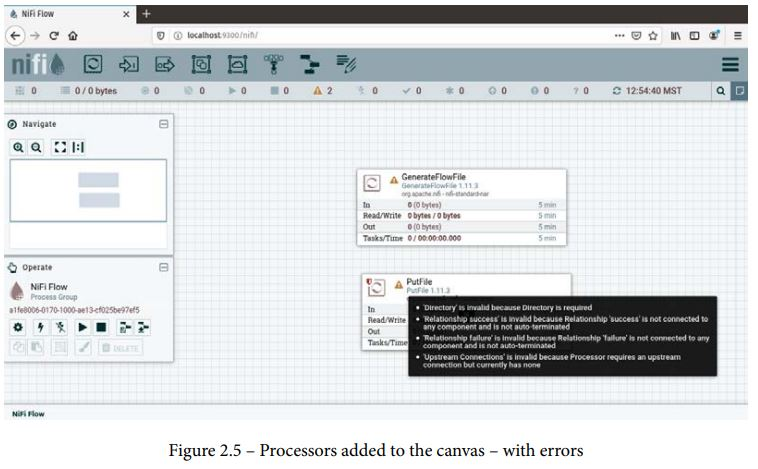


هنگامی که پردازشگرها (**Processors**) را اضافه می‌کنید، یک **نماد هشدار** (⚠) در گوشه چپ آن‌ها ظاهر می‌شود. این هشدارها به دلیل **عدم پیکربندی** پردازشگرها و وجود **خطاهای تنظیماتی** هستند.  

🔴 **دلایل اصلی این هشدارها:**  
- پردازشگر **PutFile** مقدار **Directory** ندارد.  
- هیچ **اتصالی (Connection)** بین پردازشگرها تعریف نشده است.  
- **روابط (Relationships)** برای حالت‌های **موفق (Success)** و **ناموفق (Failure)** تنظیم نشده‌اند.  


**۱. پیکربندی پردازشگرها (Processors Configuration)**  

✅ برای تنظیم پردازشگرها، می‌توانید:  
- روی پردازشگر **دوبار کلیک** کنید.  
- یا روی پردازشگر **کلیک راست** کرده و گزینه **Properties** را انتخاب کنید.  


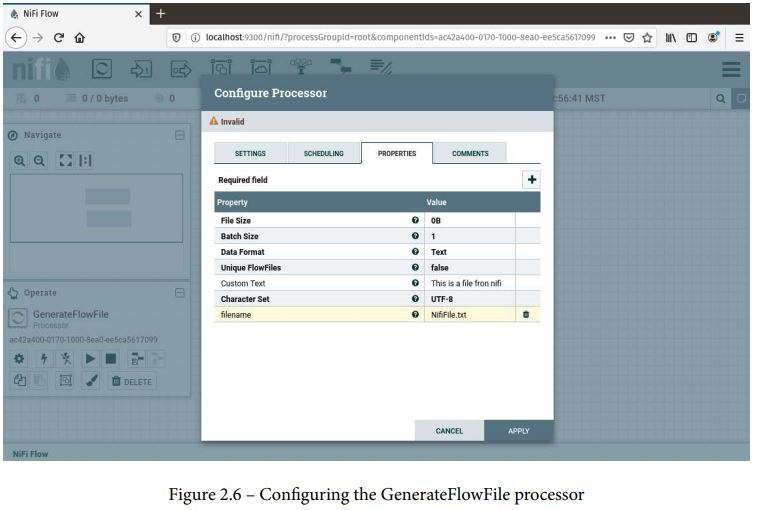

📌 **مراحل پیکربندی:**  

 **۱. تنظیم پارامترهای ضروری**  
🔹 در پنجره تنظیمات، مقادیر پارامترهایی که به‌صورت **Bold (پررنگ)** هستند، باید مقداردهی شوند.  
🔹 در کنار هر پارامتر، **علامت سؤال** (❓) وجود دارد که توضیحی درباره آن ارائه می‌دهد.  

 **۲. تنظیم پردازشگر GenerateFlowFile**  
🔹 این پردازشگر **نیازی به تغییر ندارد** زیرا مقادیر لازم از قبل پر شده‌اند.  
🔹 اگر می‌خواهید **ویژگی‌های سفارشی (Custom Properties)** اضافه کنید:  
  - روی **علامت +** در گوشه بالا سمت راست کلیک کنید.  
  - در پنجره بازشده، یک **نام** و **مقدار** مشخص کنید.  
  - مثال:  
    - **نام:** `filename`  
    - **مقدار:** `"This is a file from NiFi"`  

✅ پس از تنظیمات، نماد هشدار **(⚠)** به یک **مربع زرد** (⏹) تغییر می‌کند که نشان‌دهنده توقف پردازشگر است.  

 **۲. ایجاد ارتباط بین پردازشگرها (Connections & Relationships)**  

🔹 پس از پیکربندی **GenerateFlowFile**، باید یک اتصال به **PutFile** ایجاد کنید:  

📌 **مراحل اتصال پردازشگرها:**  
1️⃣ **موس را روی پردازشگر GenerateFlowFile ببرید** تا یک **دایره و فلش** ظاهر شود.  
2️⃣ **دایره را بکشید (Drag)** و آن را روی پردازشگر **PutFile** رها کنید.  
3️⃣ در پنجره بازشده، گزینه **Success** (که به‌صورت پیش‌فرض فعال است) را **تأیید** کنید.  
4️⃣ روی **OK** کلیک کنید.  

✅ حالا پردازشگرها به هم متصل شده‌اند و داده‌ها از **GenerateFlowFile** به **PutFile** ارسال خواهند شد.  

 **۳. اجرای جریان داده (Running the Data Flow)**  

📌 **برای اجرای پردازشگرها:**  
1️⃣ روی پردازشگر **GenerateFlowFile** **کلیک راست** کنید.  
2️⃣ گزینه **Run** را انتخاب کنید.  
3️⃣ نماد **مربع قرمز (🔴)** به **دکمه سبز پخش (▶)** تغییر خواهد کرد.  

✅ اکنون **جریان داده شما آماده اجراست!** 

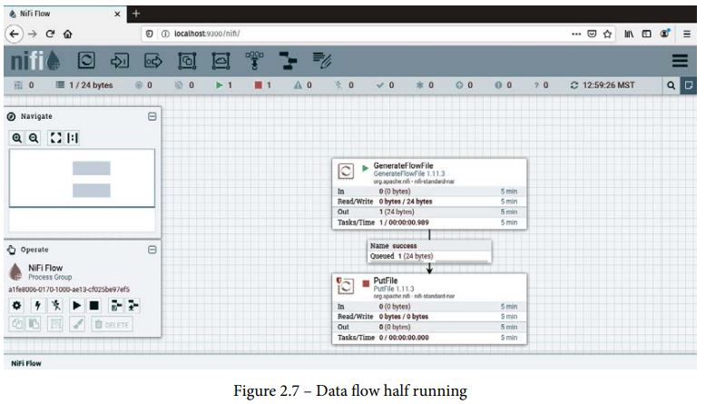

### **مدیریت و مشاهده FlowFile‌ها در NiFi**

در فاصله بین دو پردازشگر (Processor)، یک **صف (Queue)** وجود دارد که تعداد **FlowFile‌ها** و اندازه آن‌ها را نمایش می‌دهد. با **کلیک راست** روی صف، می‌توانید لیستی از **FlowFile‌ها** را مشاهده کنید، جزئیات مربوط به هرکدام را ببینید و حتی آن‌ها را دانلود کنید. 

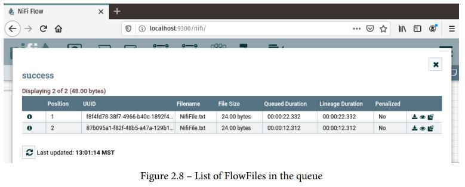
### **مشاهده جزئیات FlowFile‌ها**
در نمای جزئیات FlowFile، دو تب وجود دارد:

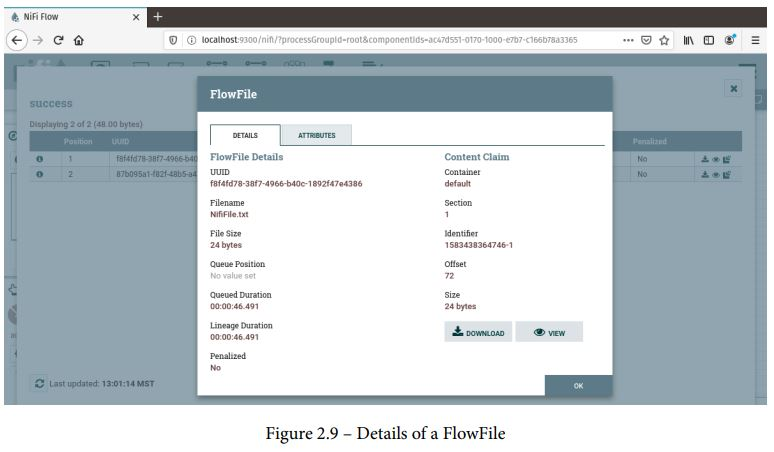

1. **DETAILS:**  
   - شامل متادیتای NiFi  
   - امکان مشاهده و دانلود FlowFile  

2. **ATTRIBUTES:**  
   - نمایش ویژگی‌های اختصاص داده‌شده توسط NiFi  
   - نمایش ویژگی‌های تعریف‌شده در پایپ‌لاین داده  

همچنین، می‌توانید **محتوای FlowFile** را مشاهده کنید که برای داده‌های متنی مناسب‌تر است. امکان مشاهده فایل در **فرمت هگزادسیمال (Hex)** و همچنین انتخاب نمایش داده به‌صورت **خام (Raw) یا فرمت‌بندی‌شده (Formatted)** نیز وجود دارد.

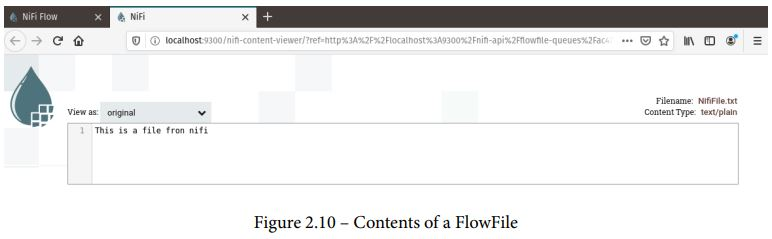
### **ذخیره FlowFile روی دیسک**
**پردازشگر PutFile** فایل FlowFile را به‌عنوان یک فایل روی سیستم ذخیره می‌کند. مسیر پیش‌فرض این فایل **`opt/nifioutput/`** است، اما در تنظیمات پردازشگر می‌توانید مسیر آن را تغییر دهید. اگر دسترسی ریشه (Root) ندارید، بهتر است مسیر ذخیره را به **دایرکتوری Home** خود تغییر دهید.

با اجرای این پایپ‌لاین، هر **10 ثانیه یک فایل جدید تولید شده و در دیسک ذخیره می‌شود**، اما این فایل **بر روی فایل قبلی بازنویسی خواهد شد**.

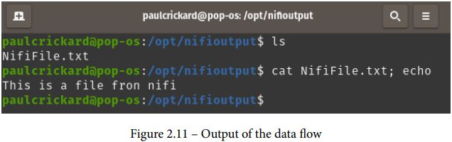
---

### **گام بعدی: نصب Apache Airflow**
در ادامه، تمرکز اصلی روی **Apache NiFi** خواهد بود و در فصل‌های بعدی، جزئیات بیشتری در مورد **ساخت پایپ‌لاین‌های داده** ارائه خواهد شد. همچنین، ابزار بعدی که نصب و بررسی خواهد شد، **Apache Airflow** است.