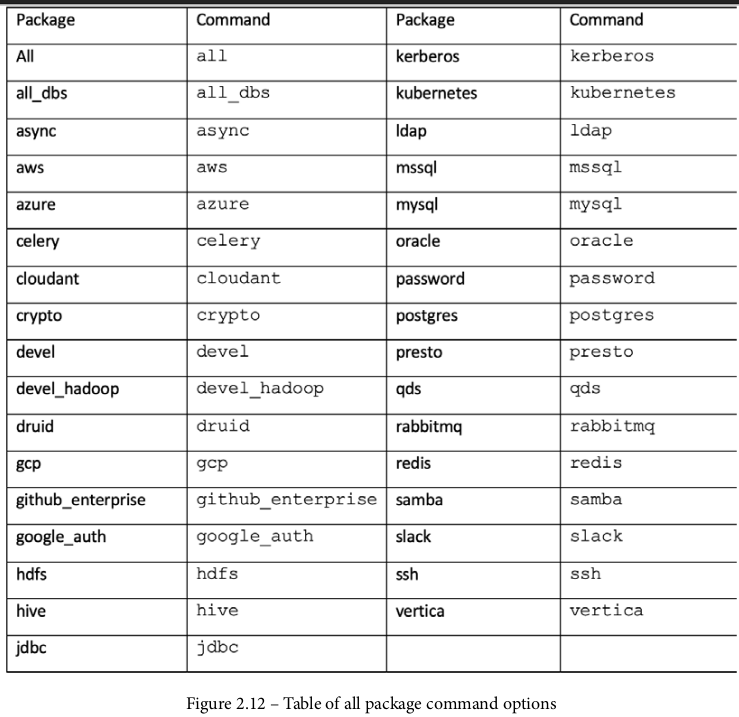
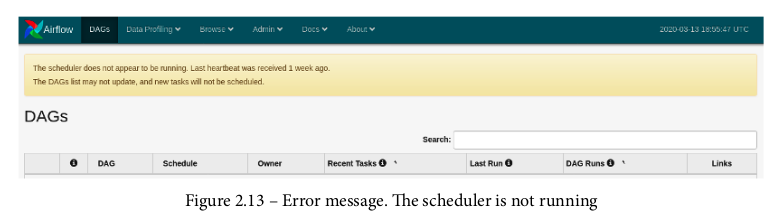
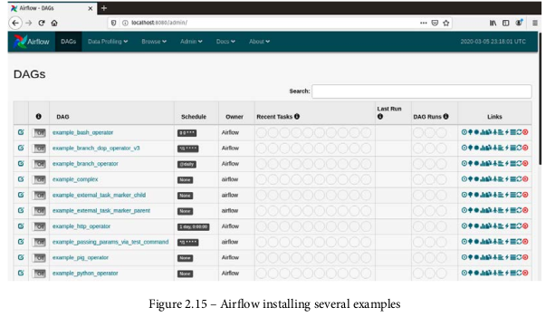
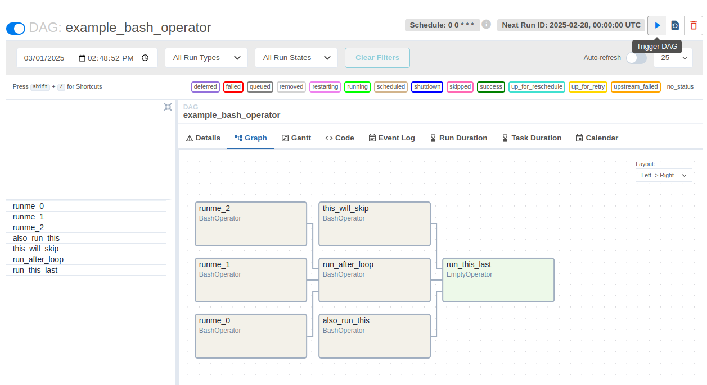

### **نصب و پیکربندی Apache Airflow**  

Apache Airflow نیز مانند Apache NiFi ابزاری برای مدیریت **پایپ‌لاین‌های داده** است، اما به جای رابط کاربری گرافیکی، این امکان را فراهم می‌کند که جریان‌های داده را **با استفاده از کد Python** ایجاد کنید. اگر شما توسعه‌دهنده‌ی **ماهر در Python** هستید، Airflow می‌تواند **گزینه‌ی ایده‌آلی** برای شما باشد.  

در حالی که Airflow از نظر **GUI نسبت به NiFi ضعیف‌تر** است، اما **انعطاف‌پذیری بیشتری** برای ایجاد وظایف و مدیریت داده‌ها ارائه می‌دهد.  

---

### **مراحل نصب Apache Airflow**  
برای نصب Apache Airflow، می‌توان از **`pip`** استفاده کرد. اما قبل از نصب، می‌توان مسیر نصب Airflow را تغییر داد.  

اگر می‌خواهید که Airflow در مسیر **`/opt/airflow`** نصب شود، می‌توانید متغیر **`AIRFLOW_HOME`** را به این مسیر اختصاص دهید:  

```bash
export AIRFLOW_HOME=/opt/airflow
```
اگر این متغیر را تنظیم نکنید، مسیر پیش‌فرض **`~/airflow`** خواهد بود. در این آموزش، از **مسیر پیش‌فرض** استفاده خواهیم کرد.  

---

### **انتخاب پکیج‌های جانبی (Sub-Packages)**
هنگام نصب Airflow، می‌توانید تعیین کنید که **کدام بسته‌های جانبی (Sub-Packages)** نصب شوند.  

- اگر هیچ بسته‌ای را مشخص نکنید، تنها اجزای **اصلی Airflow** نصب خواهند شد.  
- اما اگر قرار است از **PostgreSQL** به‌عنوان دیتابیس استفاده کنید، باید پکیج مربوطه را نصب کنید:  

```bash
pip install apache-airflow[postgres]
```


هنگام نصب Airflow، می‌توان از گزینه‌های مختلفی برای نصب **تمام اجزا** یا **فقط برخی از آن‌ها** استفاده کرد.  

- اگر بخواهید **همه‌ی پکیج‌ها** را نصب کنید، می‌توانید از **`all`** استفاده کنید.  
- برای نصب **تمام دیتابیس‌ها**، از **`all_dbs`** استفاده کنید.  

در این کتاب، پکیج‌های **PostgreSQL**، **Slack** و **Celery** نصب خواهند شد.  

#### **جدول گزینه‌های نصب در Airflow**  

| گزینه | توضیح |
|-------|--------|
| `all` | نصب تمام اجزا و وابستگی‌ها |
| `all_dbs` | نصب تمام درایورهای دیتابیس |
| `postgres` | نصب پشتیبانی PostgreSQL |
| `mysql` | نصب پشتیبانی MySQL |
| `celery` | نصب Celery برای اجرای وظایف توزیع‌شده |
| `slack` | نصب پشتیبانی برای ارسال اعلان‌ها در Slack |
| `aws` | نصب پشتیبانی برای سرویس‌های AWS |
| `google` | نصب پشتیبانی برای سرویس‌های Google Cloud |
| `azure` | نصب پشتیبانی برای سرویس‌های Microsoft Azure |

برای نصب مجموعه‌ی موردنظر، کافی است مقدار مناسب را در دستور نصب قرار دهید.  

مثال:  
```bash
pip install apache-airflow[postgres, slack, celery]
```


### **نصب و راه‌اندازی Apache Airflow**  

برای نصب Apache Airflow همراه با **PostgreSQL، Slack و Celery**، از دستور زیر استفاده کنید:  

```bash
pip install 'apache-airflow[postgres,slack,celery]'
```

#### **راه‌اندازی پایگاه داده اولیه در Airflow**  
قبل از اجرای Airflow، ابتدا باید پایگاه داده آن را مقداردهی اولیه کنید:  

```bash
airflow db init
```

به‌صورت پیش‌فرض، Airflow از **SQLite** به‌عنوان پایگاه داده استفاده می‌کند. این گزینه برای تست مناسب است، اما برای محیط **تولید** و اجرای **خوشه‌ای (Clustered Mode)** باید از پایگاه داده‌ای مانند **PostgreSQL** استفاده کنید.  

---

### **حل مشکل دسترسی به دستور `airflow`**  
اگر پس از نصب، دستور `airflow` در دسترس نبود، ممکن است نیاز باشد مسیر آن را به متغیر **PATH** اضافه کنید:  

```bash
export PATH=$PATH:/home/<username>/.local/bin
```

---

### **اجرای سرور وب Airflow**  


#### ساخت کاربر جدید

```
airflow users create \
--username sajad \
--firstname taj \
--lastname User \
--role Admin \
--email sajadtajco@gmail.com
```

در ادامه از ما میخواهد پسورد را وارد کنیم.

---

مشاهده لیست کاربران
```
airflow users list
```

    id | username | email                | first_name | last_name | roles
    ===+==========+======================+============+===========+======
    1  | admin    | sajadtajco@gmail.com | Admin      | User      | Admin


سرور وب **Airflow** به‌صورت پیش‌فرض روی **پورت 8080** اجرا می‌شود، اما این پورت قبلاً در **NiFi** به **9300** تغییر یافته است. حالا می‌توانیم سرور وب Airflow را اجرا کنیم:  

```bash
airflow webserver
```

اگر پورت **8080** توسط فرآیند دیگری اشغال شده است (مثلاً اگر **NiFi** را تغییر نداده باشید)، می‌توانید پورت جدیدی برای Airflow تعیین کنید:  

```bash
airflow webserver -p 8081
```
یا انرا در فایل کانفیگ تغغیر دهید:

```
nano airflow.cfg 
```
airflow
---
    [webserver]
    access_denied_message = Access is Denied
    config_file = /home/sajad/airflow/webserver_config.py
    base_url = http://localhost:8080
    default_ui_timezone = UTC
    # Example: default_ui_timezone = America/New_York
    web_server_host = 0.0.0.0
    web_server_port = 8080


### **اجرای Airflow Scheduler**  
برای اجرای **DAG**ها در زمان‌های مشخص، باید **Scheduler** را اجرا کنید. این کار را در یک **ترمینال جداگانه** انجام دهید تا وب‌سرور Airflow متوقف نشود:  

```bash
airflow scheduler
```

اگر Scheduler اجرا نشود، Airflow همچنان کار می‌کند اما هنگام اجرای وب‌سرور، پیغام هشداری نمایش داده خواهد شد.  



### **مشاهده رابط کاربری Apache Airflow**  

پس از مقداردهی اولیه پایگاه داده، اجرای **وب‌سرور** و **Scheduler**، می‌توانید رابط کاربری **Airflow** را از طریق آدرس زیر مشاهده کنید:  

```text
http://localhost:8080
```

هنگام نصب، **Airflow** چندین **DAG نمونه** را به‌صورت پیش‌فرض اضافه می‌کند. این **DAG**ها را می‌توانید در **صفحه اصلی** مشاهده کنید.  


---

### **بررسی اولین DAG در Airflow**  

از آنجایی که **DAG**ها در Airflow از طریق **کدنویسی** ایجاد می‌شوند، این بخش تمرکز زیادی روی رابط گرافیکی ندارد. اما در ادامه نحوه تعامل با یک **DAG نمونه** را بررسی خواهیم کرد:  

1. در صفحه اصلی **Airflow**، **DAG** با نام **example_bash_operator** را انتخاب کنید.  
2. پس از ورود، به **نمای درختی (Tree View)** منتقل خواهید شد.  
3. برای مشاهده **ساختار DAG** و **وابستگی بین Tasks**، روی **تب Graph View** کلیک کنید.  



---

### **اجرای یک DAG در Airflow**  

برای اجرای **DAG** مراحل زیر را انجام دهید:  

1. **برگردید به Tree View**  
2. **DAG را فعال کنید**: در سمت چپ نام **DAG**، گزینه **On/Off** را روی **On** قرار دهید.  
3. **اجرای دستی DAG**: روی **Trigger DAG** کلیک کنید.  
4. **تأیید اجرا**: پیامی برای تأیید اجرا نمایش داده می‌شود، گزینه **Yes** را انتخاب کنید.  
5. صفحه **به‌روزرسانی** شده و می‌توانید **وضعیت اجرای DAG** را مشاهده کنید.  

---
 این **DAGهای نمونه** برای آشنایی با رابط کاربری **Airflow** مفید هستند، اما در آینده باعث شلوغی بیش از حد شده و یافتن **DAGهای سفارشی** را دشوار می‌کنند.  

برای حذف **DAGهای نمونه** مراحل زیر را دنبال کنید:  

---

### **ویرایش فایل پیکربندی airflow.cfg**  

1. فایل **airflow.cfg** را با **vi** یا هر ویرایشگر متنی دیگری باز کنید:  

   ```bash
   vi ~/airflow/airflow.cfg
   ```

2. مقدار **load_examples** را از **True** به **False** تغییر دهید:  

   ```ini
   [core]
   load_examples = False
   ```

---

### **اعمال تغییرات در پایگاه داده متادیتا**  

بعد از ذخیره تغییرات در فایل **airflow.cfg**، باید **وب‌سرور Airflow** را متوقف کرده و پایگاه داده را **ریست** کنید تا تغییرات اعمال شوند:  

1. **متوقف کردن وب‌سرور**:  

   ```bash
   pkill -f "airflow webserver"
   ```

2. **ریست کردن پایگاه داده Airflow**:  

   ```bash
   airflow db reset
   ```

   این دستور تنظیمات جدید را از **airflow.cfg** به **پایگاه داده متادیتا** منتقل می‌کند.  

3. **راه‌اندازی مجدد وب‌سرور**:  

   ```bash
   airflow webserver -p 8080
   ```

---

### **مشاهده تغییرات در GUI**  

اکنون اگر به آدرس **http://localhost:8080** مراجعه کنید، صفحه **Airflow** باید **خالی** باشد و دیگر **DAGهای نمونه** را نمایش ندهد.
