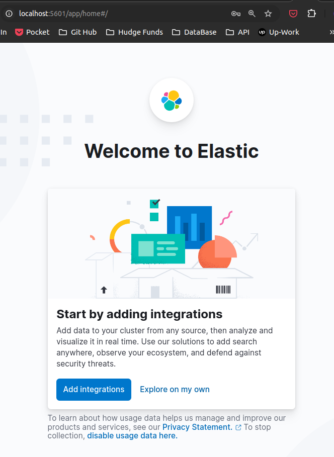
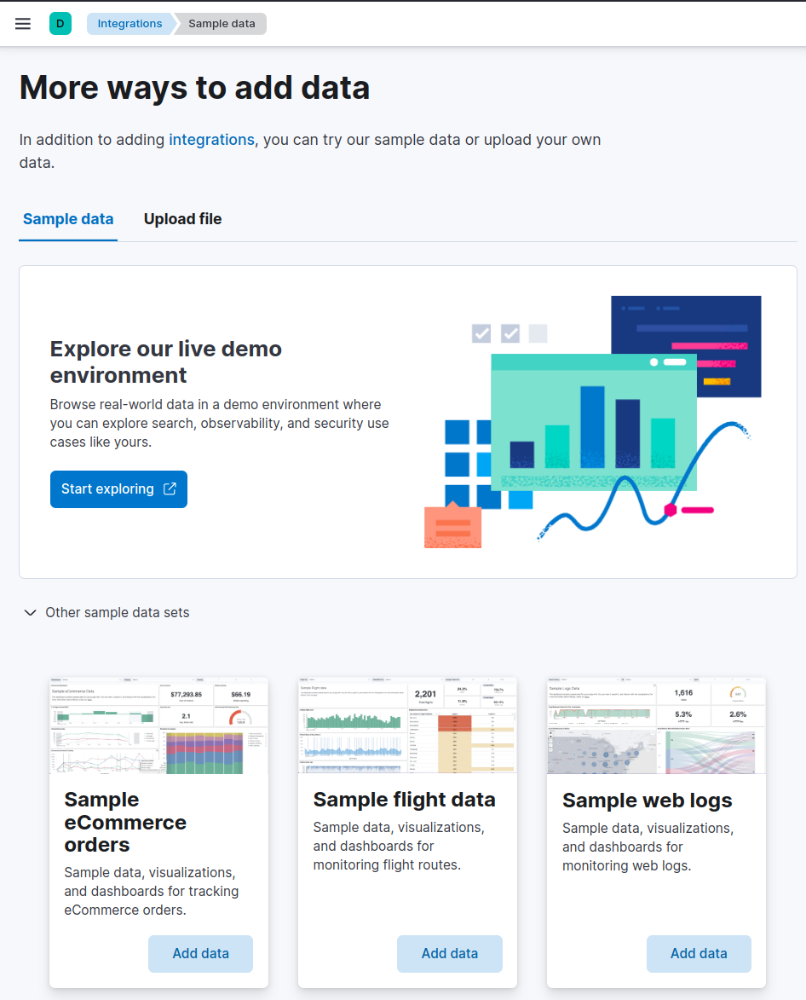
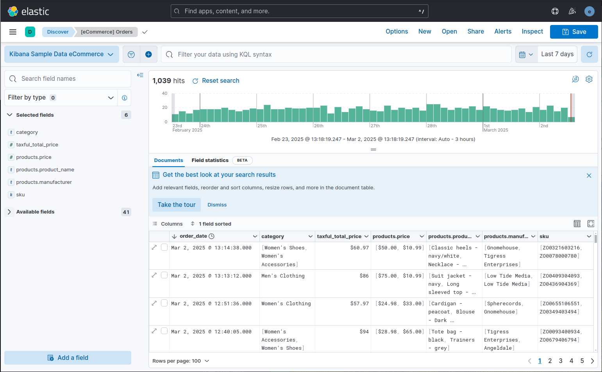
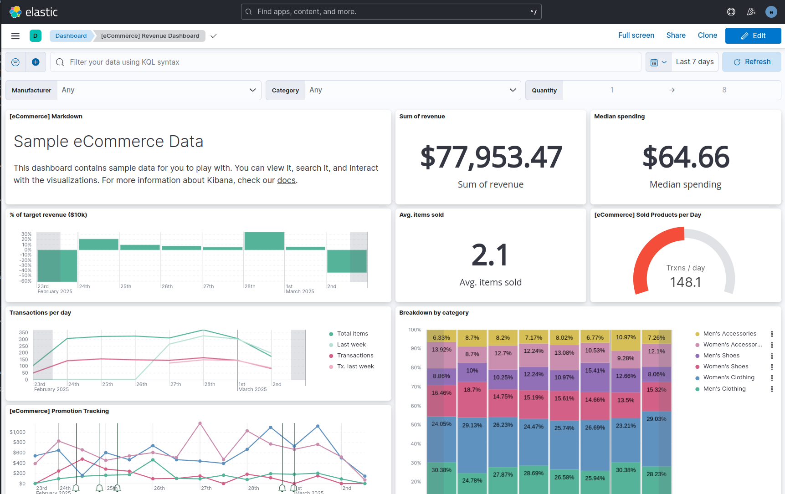
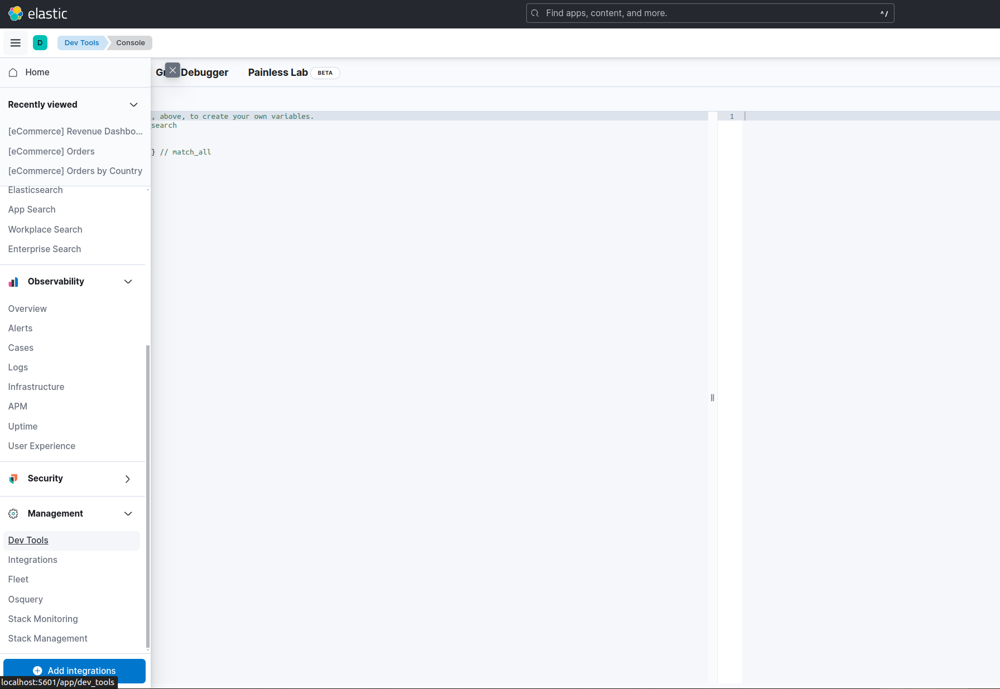

**Elasticsearch**:

 یک موتور جستجو است که در این راهنما به عنوان یک **پایگاه داده NoSQL** استفاده خواهد شد. شما داده‌ها را بین **Elasticsearch** و سایر منابع جابه‌جا خواهید کرد. برای دانلود و نصب Elasticsearch، مراحل زیر را دنبال کنید:  


**الستتیک سرچ** به‌طور پیش‌فرض دارای یک **رابط کاربری گرافیکی (GUI)** نیست و فقط از **API** استفاده می‌کند. برای افزودن یک GUI و مدیریت بهتر داده‌ها، می‌توان از **Kibana** استفاده کرد.  

کیبانا علاوه بر دسترسی به API **Elasticsearch** در یک محیط گرافیکی، امکان **ایجاد داشبوردها و تجسم داده‌ها** را نیز فراهم می‌کند. برای نصب Kibana، مراحل زیر را دنبال کنید:  

---

### ۱. ساختت مسیر پروژه 

در مسیر پروژه دو فایل زی ر ا ایجاد کنید:

+ .env
+ docker-compose.yml

محتوای فایل ها بصورت زیر :

`.env`
```
# Password for the 'elastic' user (at least 6 characters)
ELASTIC_PASSWORD=testtest

# Password for the 'kibana_system' user (at least 6 characters)
KIBANA_PASSWORD=testtest

# Version of Elastic products
STACK_VERSION=8.6.2

# Set the cluster name
CLUSTER_NAME=docker-cluster

# Set to 'basic' or 'trial' to automatically start the 30-day trial
LICENSE=basic
#LICENSE=trial

# Port to expose Elasticsearch HTTP API to the host
ES_PORT=9200
#ES_PORT=127.0.0.1:9200

# Port to expose Kibana to the host
KIBANA_PORT=5601
#KIBANA_PORT=80

# Increase or decrease based on the available host memory (in bytes)
MEM_LIMIT=1073741824

# Project namespace (defaults to the current folder name if not set)
COMPOSE_PROJECT_NAME=myproject
```


`docker-compose.yml`

```
version: "2.2"

services:
  setup:
    image: docker.arvancloud.ir/elasticsearch:${STACK_VERSION}
    volumes:
      - certs:/usr/share/elasticsearch/config/certs
    user: "0"
    command: >
      bash -c '
        if [ x${ELASTIC_PASSWORD} == x ]; then
          echo "Set the ELASTIC_PASSWORD environment variable in the .env file";
          exit 1;
        elif [ x${KIBANA_PASSWORD} == x ]; then
          echo "Set the KIBANA_PASSWORD environment variable in the .env file";
          exit 1;
        fi;
        if [ ! -f config/certs/ca.zip ]; then
          echo "Creating CA";
          bin/elasticsearch-certutil ca --silent --pem -out config/certs/ca.zip;
          unzip config/certs/ca.zip -d config/certs;
        fi;
        if [ ! -f config/certs/certs.zip ]; then
          echo "Creating certs";
          echo -ne \
          "instances:\n"\
          "  - name: es01\n"\
          "    dns:\n"\
          "      - es01\n"\
          "      - localhost\n"\
          "    ip:\n"\
          "      - 127.0.0.1\n"\
          "  - name: es02\n"\
          "    dns:\n"\
          "      - es02\n"\
          "      - localhost\n"\
          "    ip:\n"\
          "      - 127.0.0.1\n"\
          "  - name: es03\n"\
          "    dns:\n"\
          "      - es03\n"\
          "      - localhost\n"\
          "    ip:\n"\
          "      - 127.0.0.1\n"\
          > config/certs/instances.yml;
          bin/elasticsearch-certutil cert --silent --pem -out config/certs/certs.zip --in config/certs/instances.yml --ca-cert config/certs/ca/ca.crt --ca-key config/certs/ca/ca.key;
          unzip config/certs/certs.zip -d config/certs;
        fi;
        echo "Setting file permissions"
        chown -R root:root config/certs;
        find . -type d -exec chmod 750 \{\} \;;
        find . -type f -exec chmod 640 \{\} \;;
        echo "Waiting for Elasticsearch availability";
        until curl -s --cacert config/certs/ca/ca.crt https://es01:9200 | grep -q "missing authentication credentials"; do sleep 30; done;
        echo "Setting kibana_system password";
        until curl -s -X POST --cacert config/certs/ca/ca.crt -u "elastic:${ELASTIC_PASSWORD}" -H "Content-Type: application/json" https://es01:9200/_security/user/kibana_system/_password -d "{\"password\":\"${KIBANA_PASSWORD}\"}" | grep -q "^{}"; do sleep 10; done;
        echo "All done!";
      '
    healthcheck:
      test: ["CMD-SHELL", "[ -f config/certs/es01/es01.crt ]"]
      interval: 1s
      timeout: 5s
      retries: 120

  es01:
    depends_on:
      setup:
        condition: service_healthy
    image: docker.arvancloud.ir/elasticsearch:${STACK_VERSION}
    volumes:
      - certs:/usr/share/elasticsearch/config/certs
      - esdata01:/usr/share/elasticsearch/data
    ports:
      - ${ES_PORT}:9200
    environment:
      - node.name=es01
      - cluster.name=${CLUSTER_NAME}
      - cluster.initial_master_nodes=es01,es02,es03
      - discovery.seed_hosts=es02,es03
      - ELASTIC_PASSWORD=${ELASTIC_PASSWORD}
      - bootstrap.memory_lock=true
      - xpack.security.enabled=true
      - xpack.security.http.ssl.enabled=true
      - xpack.security.http.ssl.key=certs/es01/es01.key
      - xpack.security.http.ssl.certificate=certs/es01/es01.crt
      - xpack.security.http.ssl.certificate_authorities=certs/ca/ca.crt
      - xpack.security.transport.ssl.enabled=true
      - xpack.security.transport.ssl.key=certs/es01/es01.key
      - xpack.security.transport.ssl.certificate=certs/es01/es01.crt
      - xpack.security.transport.ssl.certificate_authorities=certs/ca/ca.crt
      - xpack.security.transport.ssl.verification_mode=certificate
      - xpack.license.self_generated.type=${LICENSE}
      - xpack.ml.use_auto_machine_memory_percent=true
    mem_limit: ${MEM_LIMIT}
    ulimits:
      memlock:
        soft: -1
        hard: -1
    healthcheck:
      test:
        [
          "CMD-SHELL",
          "curl -s --cacert config/certs/ca/ca.crt https://localhost:9200 | grep -q 'missing authentication credentials'",
        ]
      interval: 10s
      timeout: 10s
      retries: 120

  es02:
    depends_on:
      - es01
    image: docker.arvancloud.ir/elasticsearch:${STACK_VERSION}
    volumes:
      - certs:/usr/share/elasticsearch/config/certs
      - esdata02:/usr/share/elasticsearch/data
    environment:
      - node.name=es02
      - cluster.name=${CLUSTER_NAME}
      - cluster.initial_master_nodes=es01,es02,es03
      - discovery.seed_hosts=es01,es03
      - ELASTIC_PASSWORD=${ELASTIC_PASSWORD}
      - bootstrap.memory_lock=true
      - xpack.security.enabled=true
      - xpack.security.http.ssl.enabled=true
      - xpack.security.http.ssl.key=certs/es02/es02.key
      - xpack.security.http.ssl.certificate=certs/es02/es02.crt
      - xpack.security.http.ssl.certificate_authorities=certs/ca/ca.crt
      - xpack.security.transport.ssl.enabled=true
      - xpack.security.transport.ssl.key=certs/es02/es02.key
      - xpack.security.transport.ssl.certificate=certs/es02/es02.crt
      - xpack.security.transport.ssl.certificate_authorities=certs/ca/ca.crt
      - xpack.security.transport.ssl.verification_mode=certificate
      - xpack.license.self_generated.type=${LICENSE}
      - xpack.ml.use_auto_machine_memory_percent=true
    mem_limit: ${MEM_LIMIT}
    ulimits:
      memlock:
        soft: -1
        hard: -1
    healthcheck:
      test:
        [
          "CMD-SHELL",
          "curl -s --cacert config/certs/ca/ca.crt https://localhost:9200 | grep -q 'missing authentication credentials'",
        ]
      interval: 10s
      timeout: 10s
      retries: 120

  es03:
    depends_on:
      - es02
    image: docker.arvancloud.ir/elasticsearch:${STACK_VERSION}
    volumes:
      - certs:/usr/share/elasticsearch/config/certs
      - esdata03:/usr/share/elasticsearch/data
    environment:
      - node.name=es03
      - cluster.name=${CLUSTER_NAME}
      - cluster.initial_master_nodes=es01,es02,es03
      - discovery.seed_hosts=es01,es02
      - ELASTIC_PASSWORD=${ELASTIC_PASSWORD}
      - bootstrap.memory_lock=true
      - xpack.security.enabled=true
      - xpack.security.http.ssl.enabled=true
      - xpack.security.http.ssl.key=certs/es03/es03.key
      - xpack.security.http.ssl.certificate=certs/es03/es03.crt
      - xpack.security.http.ssl.certificate_authorities=certs/ca/ca.crt
      - xpack.security.transport.ssl.enabled=true
      - xpack.security.transport.ssl.key=certs/es03/es03.key
      - xpack.security.transport.ssl.certificate=certs/es03/es03.crt
      - xpack.security.transport.ssl.certificate_authorities=certs/ca/ca.crt
      - xpack.security.transport.ssl.verification_mode=certificate
      - xpack.license.self_generated.type=${LICENSE}
      - xpack.ml.use_auto_machine_memory_percent=true
    mem_limit: ${MEM_LIMIT}
    ulimits:
      memlock:
        soft: -1
        hard: -1
    healthcheck:
      test:
        [
          "CMD-SHELL",
          "curl -s --cacert config/certs/ca/ca.crt https://localhost:9200 | grep -q 'missing authentication credentials'",
        ]
      interval: 10s
      timeout: 10s
      retries: 120

  kibana:
    depends_on:
      es01:
        condition: service_healthy
      es02:
        condition: service_healthy
      es03:
        condition: service_healthy
    image: docker.arvancloud.ir/kibana:${STACK_VERSION}
    volumes:
      - certs:/usr/share/kibana/config/certs
      - kibanadata:/usr/share/kibana/data
    ports:
      - ${KIBANA_PORT}:5601
    environment:
      - SERVERNAME=kibana
      - ELASTICSEARCH_HOSTS=https://es01:9200
      - ELASTICSEARCH_USERNAME=kibana_system
      - ELASTICSEARCH_PASSWORD=${KIBANA_PASSWORD}
      - ELASTICSEARCH_SSL_CERTIFICATEAUTHORITIES=config/certs/ca/ca.crt
    mem_limit: ${MEM_LIMIT}
    healthcheck:
      test:
        [
          "CMD-SHELL",
          "curl -s -I http://localhost:5601 | grep -q 'HTTP/1.1 302 Found'",
        ]
      interval: 10s
      timeout: 10s
      retries: 120

volumes:
  certs:
    driver: local
  esdata01:
    driver: local
  esdata02:
    driver: local
  esdata03:
    driver: local
  kibanadata:
    driver: local
```
---

### نکته

از محازن ابراروان برای ایمیج های داکر درون داکر کمپوز برای هر کانتینر استفاده گردیده است.
```bash
 image: docker.arvancloud.ir/elasticsearch:${STACK_VERSION}
 image: docker.arvancloud.ir/kibana:${STACK_VERSION}
```

---

### راه اندازی کانتینر ها  

```bash
docker cosmpose build
docker compoe up -d
```

---

### 2. اجرای Kibana


پس از اجرا، Kibana از طریق **http://localhost:5601** در دسترس خواهد بود. Kibana به‌طور پیش‌فرض به دنبال یک **Elasticsearch** در **localhost:9200** می‌گردد.  

هنگامی که Kibana باز شود، با دو گزینه مواجه خواهید شد:  

- **Add Integrations** (امتحان داده‌های نمونه)  
- **Explore on my own** (کاوش به‌صورت مستقل)  


---


اگر به صورت مستقل (Explore on my own) ادامه دهید، به صفحه اصلی Kibana هدایت خواهید شد. اما از آنجایی که هنوز هیچ ایندکس (Index) در Elasticsearch ایجاد نکرده‌اید و داده‌ای بارگذاری نشده است، برنامه خالی خواهد بود. برای مشاهده ابزارهای مختلف موجود از home در Kibana، گزینه **Try our sample data** (داده‌های نمونه ما را امتحان کنید) را انتخاب کنید و داده‌های مربوط به **e-commerce** را بارگذاری کنید. تصویر زیر گزینه‌های موجود برای **Load our Sample Data** (بارگذاری داده‌های نمونه) را نشان می‌دهد:


---

#### **استفاده از داده‌های نمونه:**
1. **Discover (کشف):**
   - پس از بارگذاری داده‌های نمونه، آیکون **Discover** را انتخاب کنید.
   - در بخش **Discover**، می‌توانید رکوردهای موجود در داده‌ها را مشاهده کنید.
   - اگر داده‌ها شامل تاریخ باشند، یک نمودار میله‌ای (Bar Chart) از تعداد رکوردها در بازه‌های زمانی مشخص نمایش داده می‌شود.
   - می‌توانید یکی از میله‌ها را انتخاب کنید یا بازه‌های تاریخ را از این تب تغییر دهید.

2. **نمایش داده‌ها:**
   - انتخاب یک رکورد، داده‌ها را به صورت جدولی یا نمای JSON نمایش می‌دهد.
   - همچنین می‌توانید پرس‌وجوهایی (Queries) روی داده‌ها اجرا کنید و آن‌ها را به عنوان اشیاء ذخیره کنید تا بعداً در بصری‌سازی‌ها (Visualizations) استفاده شوند.

تصویر زیر صفحه اصلی **Discover** را نشان می‌دهد:


---


از داده‌های موجود در تب **Discover** یا از یک پرس‌وجوی ذخیره‌شده، می‌توانید بصری‌سازی‌ها (Visualizations) ایجاد کنید. این بصری‌سازی‌ها شامل نمودارهای میله‌ای (افقی و عمودی)، نمودارهای دایره‌ای/دونات، شمارش‌ها، فرمت‌های Markdown، نقشه‌های حرارتی (Heatmaps) و حتی یک ابزار نقشه برای مدیریت داده‌های مکانی (Geospatial Data) هستند.

---

#### **ایجاد داشبوردها:**
- وقتی چندین بصری‌سازی ایجاد کردید – از یک ایندکس یا از چندین ایندکس الستیک سرچ – می‌توانید آن‌ها را به یک داشبورد اضافه کنید.
- کیبانا به شما امکان می‌دهد ابزارهای (Widgets) مختلف را با استفاده از داده‌های چندین ایندکس بارگذاری کنید.
- هنگامی که در داشبورد پرس‌وجو یا فیلتر اعمال می‌کنید، به شرطی که نام فیلد در هر یک از ایندکس‌ها وجود داشته باشد، تمام ابزارها به‌روزرسانی خواهند شد.
- تصویر زیر یک داشبورد را نشان می‌دهد که از چندین بصری‌سازی از داده‌های **e-commerce** تشکیل شده است:


---

#### **ابزار توسعه‌دهنده (Developer Tools):**
- تب **Developer Tools** برای تست سریع پرس‌وجوهای Elasticsearch قبل از پیاده‌سازی آن‌ها در یک خط لوله مهندسی داده (Data Engineering Pipeline) بسیار مفید است.
- از این تب می‌توانید ایندکس‌ها و داده‌ها را ایجاد کنید، پرس‌وجوها را برای فیلتر کردن، جستجو یا تجمیع داده‌ها اجرا کنید.
- نتایج در پنجره اصلی نمایش داده می‌شوند.
- تصویر زیر نشان می‌دهد که یک رکورد به یک ایندکس اضافه می‌شود و سپس جستجویی برای یک ID خاص انجام می‌شود:


---

### **نصب PostgreSQL و pgAdmin 4:**
حالا که Elasticsearch و Kibana را نصب کرده‌اید، دو بخش بعدی شما را در نصب **PostgreSQL** و **pgAdmin 4** راهنمایی خواهند کرد. پس از اتمام این مراحل، هم یک پایگاه داده SQL و هم یک پایگاه داده NoSQL برای کاوش خواهید داشت.

--