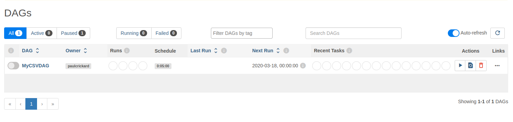
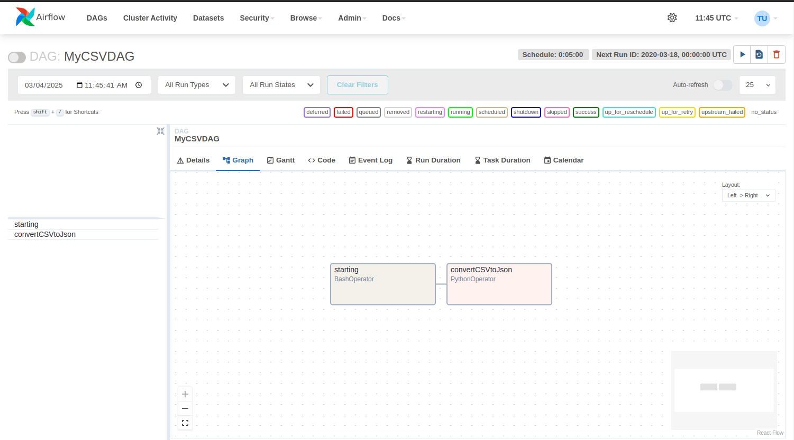

<!-- language: rtl -->
<div dir="rtl" align="right" >


# **ساخت پایپ‌لاین داده در Apache Airflow**
**Apache Airflow** از توابع پایتون و اپراتورهایی مانند **Bash** برای ایجاد تسک‌هایی استفاده می‌کند که در قالب یک **گراف جهت‌دار غیرمدور (DAG)** سازماندهی می‌شوند. این DAGها وظایف را با ترتیب مشخص اجرا کرده **GUI** هستند.

---

### **ایجاد یک پایپ‌لاین برای تبدیل CSV به JSON**
در این پروژه یک **DAG ساده** ساخته می‌شود که شامل دو وظیفه است:
1. نمایش پیام از طریق Bash
2. خواندن فایل CSV و تبدیل آن به JSON

#### **1. نصب پیش‌نیازها و وارد کردن کتابخانه‌ها**
در یک فایل جدید پایتون، کتابخانه‌های موردنیاز را وارد کنید:

```python
import datetime as dt
from datetime import timedelta
from airflow import DAG
from airflow.operators.bash_operator import BashOperator
from airflow.operators.python_operator import PythonOperator
import pandas as pd
```

#### **2. تعریف تابع برای تبدیل CSV به JSON**
این تابع **فایل CSV را خوانده، نام‌ها را چاپ کرده و خروجی را در یک فایل JSON ذخیره می‌کند**:

```python
def CSVToJson():
    df = pd.read_csv('/home/paulcrickard/data.csv')
    for i, r in df.iterrows():
        print(r['name'])
    df.to_json('fromAirflow.json', orient='records')
```

#### **3. تعریف آرگومان‌های پیش‌فرض برای DAG**
در این بخش تنظیمات مربوط به **صاحب DAG، تاریخ شروع، تعداد تلاش مجدد و تاخیر بین تلاش‌ها** تعریف می‌شود:

```python
default_args = {
    'owner': 'paulcrickard',
    'start_date': dt.datetime(2020, 3, 18),
    'retries': 1,
    'retry_delay': dt.timedelta(minutes=5),
}
```

#### **4. ایجاد DAG و تنظیم زمان‌بندی**
DAG با **یک شناسه مشخص** ایجاد شده و هر ۵ دقیقه یکبار اجرا می‌شود:

```python
with DAG(
    'MyCSVDAG',
    default_args=default_args,
    schedule_interval=timedelta(minutes=5),
) as dag:
```

#### **5. تعریف تسک‌ها**
- **وظیفه اول:** نمایش پیام از طریق **BashOperator**  
- **وظیفه دوم:** تبدیل CSV به JSON از طریق **PythonOperator**

```python
print_starting = BashOperator(
    task_id='starting',
    bash_command='echo "I am reading the CSV now....."'
)

CSVJson = PythonOperator(
    task_id='convertCSVtoJson',
    python_callable=CSVToJson
)
```

#### **6. تنظیم ترتیب اجرای تسک‌ها**
تسک `print_starting` باید قبل از `CSVJson` اجرا شود. این ارتباط را می‌توان به یکی از روش‌های زیر مشخص کرد:

```python
print_starting >> CSVJson  # روش توصیه‌شده
# یا
CSVJson.set_upstream(print_starting)
```

#### **7. اجرای DAG در Apache Airflow**
- اطمینان حاصل کنید که مسیر **dags_folder** در **airflow.cfg** به درستی تنظیم شده است.
- سپس فایل DAG را در این مسیر کپی کنید و دستورات زیر را اجرا نمایید:

```bash
airflow webserver
airflow scheduler
```

- **GUI را در مرورگر باز کنید**:  
  - آدرس: [http://localhost:8080](http://localhost:8080)
  - در این صفحه می‌توانید **DAG خود را مشاهده و اجرا کنید**.


---

